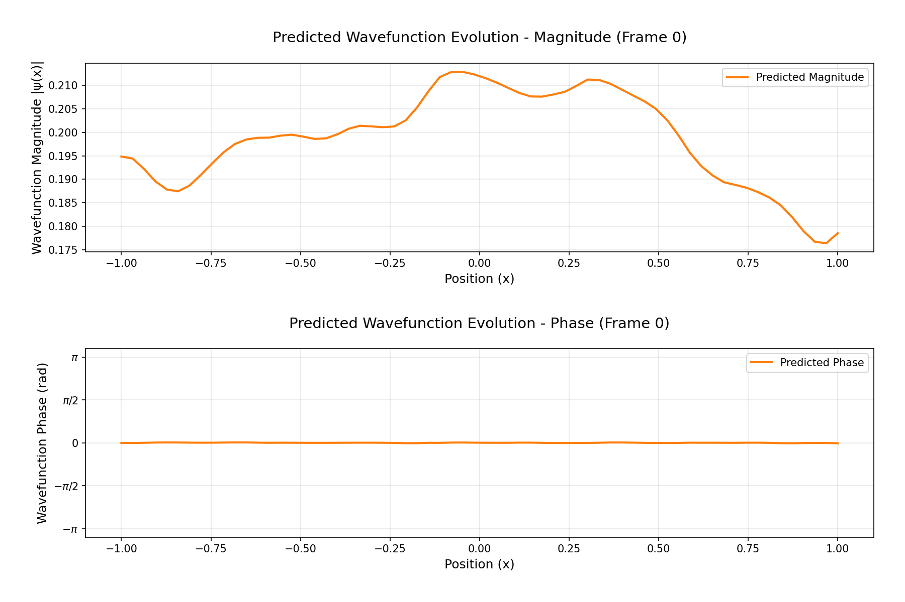

# 🎮 SillyAI - Quantum Wavefunction Learning

<div align="center">

*A quantum-inspired transformer model for general-purpose use cases*

</div>

## 🌟 Overview

SillyAI is an advanced transformer model that combines quantum computing principles with modern deep learning techniques. It specializes in learning and predicting quantum wavefunctions, making it particularly powerful for physics simulations and quantum system analysis.

<div align="center">
  
  <br>
  <em>Real-time visualization of wavefunction evolution during training</em>
</div>

## 🚀 Key Features

### 🎯 Mixed Precision Architecture
- Dynamic precision adaptation (Ternary, INT4, FP4, FP8, FP16)
- Optimized for both CPU and GPU execution
- Memory-efficient tensor operations
- JIT compilation support

### 🧠 Concept Graph System
- Dynamic concept relationship visualization
- Energy-based weighting mechanism
- LFU-based graph updates
- Real-time concept evolution tracking

### 🔌 Plugin System
- Dynamic plugin loading/unloading
- Extensible architecture
- Built-in visualization tools
- Custom training pipelines

### 📊 Visualization Tools
- Real-time wavefunction plotting
- Resource usage monitoring
- Training progress tracking
- Concept graph visualization

## 🛠️ Installation

```bash
# Clone the repository
git clone https://github.com/bumbelbee777/sillyai.git
cd sillyai

# Create a virtual environment
python -m venv venv
source venv/bin/activate  # On Windows: venv\Scripts\activate

# Install dependencies
pip install -r requirements.txt
```

## 🎮 Quick Start

```python
from sillyai import SillyAI, ModelConfig
from sillyai.ops import MultivectorOps

# Initialize configuration
config = ModelConfig(
    d_model=64,
    n_heads=4,
    n_layers=2,
    max_seq_len=64
)

# Create model
model = SillyAI(config, ops=MultivectorOps().compile())

# Train the model
model.train()
```

## 🎯 Some Use Cases

- Quantum system simulation
- Wavefunction prediction
- Physics-based learning
- Signal processing
- Complex system modeling
- Equation solving
- NLP

## 🤝 Contributing

We welcome contributions! Please see our [Contributing Guide](CONTRIBUTING.md) for details.

## 📝 License

This project is licensed under the MIT License - see the [LICENSE](LICENSE) file for details.

## 🙏 Acknowledgments

- PyTorch team for the amazing deep learning framework
- Google's InfiniContext paper for the attention layer inspiration
